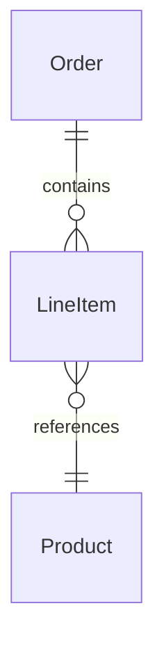
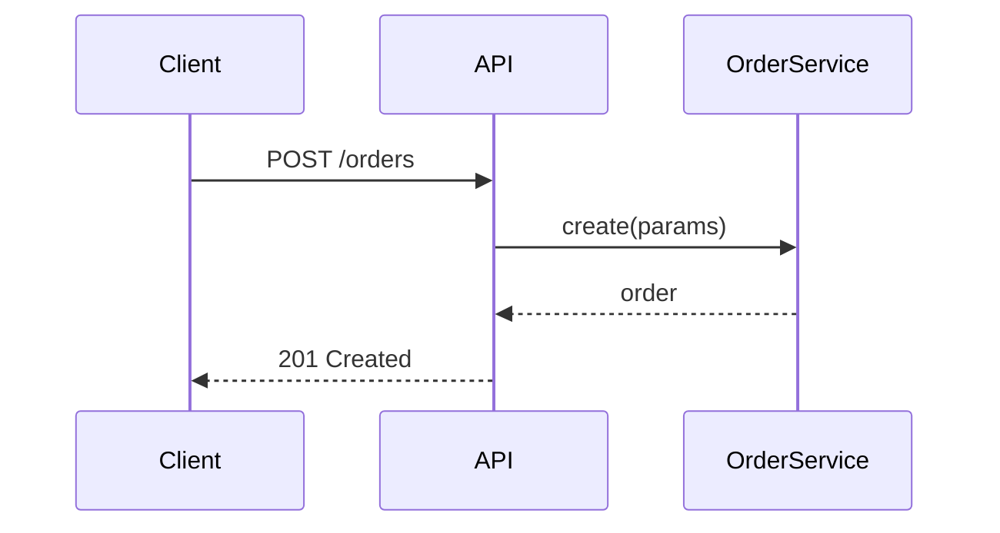
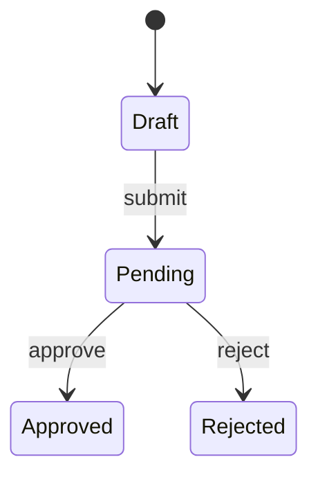
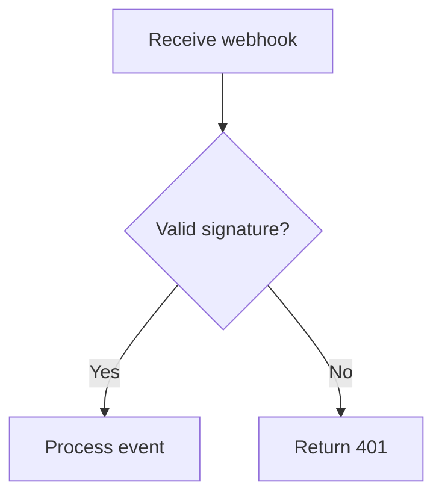
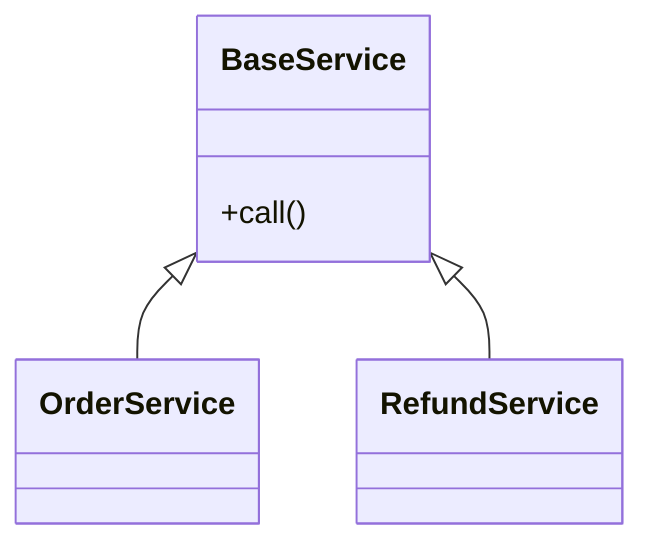

<!-- PR size guidance:
Research shows review quality drops sharply beyond ~400 lines changed.
What matters is cognitive load, not raw line count:
  - 500 lines of migration + 100 lines of logic = easy to review
  - 300 lines across 15 files touching 3 subsystems = hard to review

If a PR exceeds 400 lines of meaningful changes, consider splitting it.
When a large PR can't be split, the Review guide section becomes critical —
tell the reviewer where the lines that matter are so they don't skim everything equally.

Trivial PR rule:
A PR is trivial when ALL three of these are true:
  1. No decisions were made — there was only one reasonable way to do it
  2. The diff is self-explanatory — a reviewer understands the change faster reading code than a description
  3. No behavioral change — dependency bumps, typo fixes, config tweaks, generated code updates

For trivial PRs, omit: Decisions & trade-offs, How it works, Review guide.
Keep: Summary, Context, Verification, Files, Links. -->

## Summary

{1-2 sentences: what does this PR do and why}

## Context

{Why are we doing this? What problem exists, what triggered this work, what's the business or technical motivation}

## Decisions & trade-offs

{Key choices made during implementation. What alternatives were considered? Why this approach over others? Any compromises or known limitations?}

## How it works

{Explain the implementation at a level useful for review. Walk through the approach, call out non-obvious logic, and show how pieces connect.}

<!-- Include a mermaid diagram based on the type of change:

Database/migration changes → ERD:

Request/response flows, API changes → sequence diagram:

State machines, status transitions → state diagram:

Multi-step workflows, branching logic → flowchart:

Class hierarchy, module structure → class diagram:

Use multiple diagrams if the PR spans several change types.
Delete this comment block and keep only the relevant diagram(s). -->

## Review guide

**Focus on:**
- {files/areas that contain the core logic and need careful review}

**Skim/skip:**
- {boilerplate, generated code, mechanical changes}

## Verification

<!-- Write steps so that a human or AI agent can verify the change.
     Each step should have: action, command/procedure, and expected result. -->

| Step | Action | Expected result |
|------|--------|-----------------|
| 1 | {setup: preconditions, seed data, config} | {ready state} |
| 2 | {command or action to perform} | {specific observable outcome} |
| 3 | `bundle exec rspec spec/path/to_spec.rb` | {all examples pass} |

## Files

| File | Purpose |
|------|---------|
| `{filename}` | {what this file does in the context of this PR} |

## Links

<!-- Link guidelines:
- Do NOT link to this PR itself — the reader is already on it.
- DO link to: PRs this depends on, follow-up PRs, related Slack threads, docs, external references.
- Do NOT link to merge commits that reference this PR — that's just GitHub showing the merge event, not related work. -->

- **Linear:** {LINEAR_URL}
